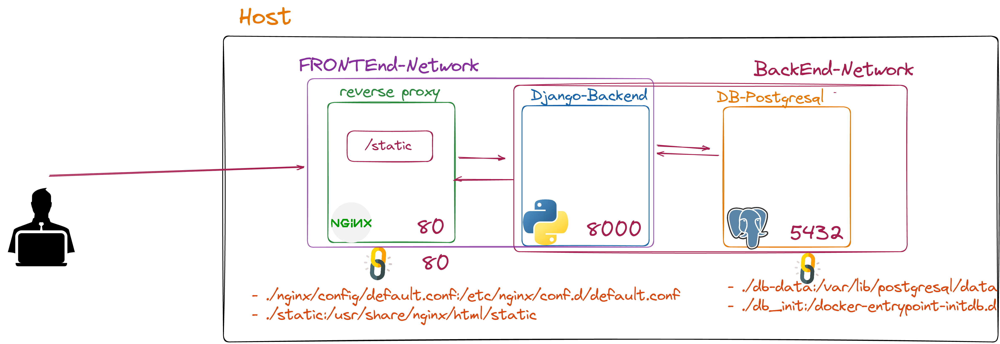

# Gutendex

This project is based on https://github.com/garethbjohnson/gutendex, a Self-hosted web API for serving book catalog information from Project Gutenberg, an online library of free ebooks.

## What I did

In this project, I built my own Docker files and connected the Gutendex application to a PostgreSQL database. I also set up a reverse proxy using nginx, and served the static files under the reverse proxy.

Additionally, I set up a two docker networks. One is for the front end, and the other for the backend.
## Architecture



## How to run

To run this project, you will need to have Docker and Docker Compose installed on your machine.

Clone this repository to your local machine
```
git clone https://github.com/elior7557/Lavagna.git
```
Navigate to the root directory of the repository
```
cd Lavagna
```

Run docker-compose up to start the Lavagna application
```
docker compose up -d
```

    
## Access The Aplication
The application should now be running on your local machine.<br> You can access it by visiting http://localhost:80 in your web browser. <br>
